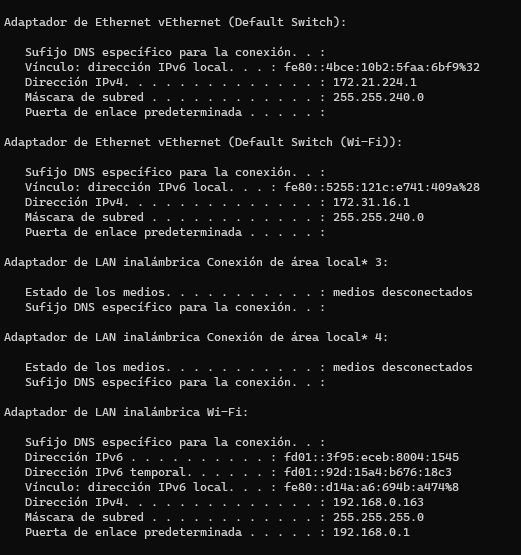
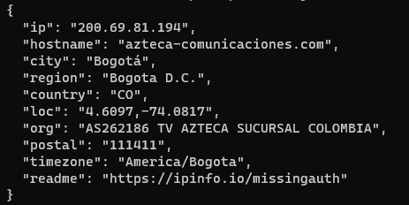
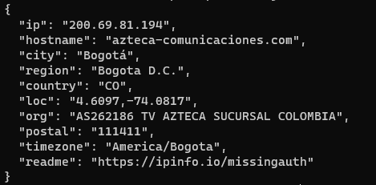
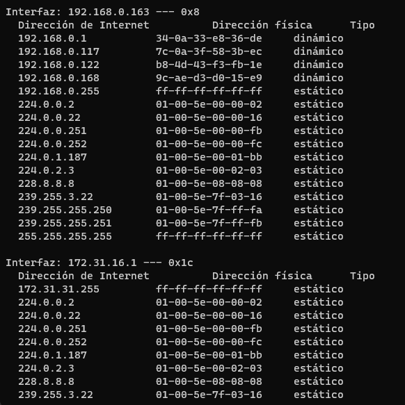

# Telematics

## 2. [Preguntas reflexivas de ambientación](#) ✔

<ol type="a">
<li>¿Cual es la dirección de red y de broadcast de un host que tiene una ip 192.168.10.10/30?.</li>
<code>

192.168.10.10 => 11000000.10101000.00001010.00001010 
Máscara /30   => 11111111.11111111.11111111.11111100 
Dirección de red: 192.168.10.8

Como nuestra direccion es de mascara /30 este tendra 2 bits por cada host utilizado 232-30-2 = 2, entonces la dirección de broadcast es 192.168.10.11 que es la ultima dirección de la red.
</code>

<li>¿Que información se puede inferir de un host con la dirección 169.254.255.200/26?.</li>

<code>
La dirección IP "169.254.255.200/26" nos proporciona información sobre la dirección IP del host y la máscara de subred que se está utilizando. Aquí hay información que se puede inferir de esta dirección:  

- Dirección IP del Host: La dirección IP del host es "169.254.255.200".

- Máscara de Subred: La máscara de subred está representada por "/26". Esto significa que los primeros 26 bits de la dirección IP se utilizan para identificar la red y los últimos 6 bits se utilizan para identificar hosts en la red.

- Rango de Direcciones IP: Dado que la máscara de subred es /26, el rango de direcciones IP en esta subred se calcula utilizando las direcciones de red y de broadcast. La dirección de red se obtiene al poner en 0 los bits que corresponden a los hosts. La dirección de broadcast se obtiene poniendo en 1 los bits de host. El rango de direcciones IP utilizable en esta subred sería desde la dirección de red + 1 hasta la dirección de broadcast - 1.

- Número de Hosts: Dado que hay 6 bits para identificar hosts en la subred, esto permite 2^6 - 2 (restamos 2 para la dirección de red y la de broadcast) = 62 direcciones de host posibles en esta subred.
</code>

<li>¿Cuantas sub-redes puede lograr con la mascara 172.16.0.0/22?.</li>

<code>
11111111.11111111.111111|00.00000000| -> 10 sub-redes 
2n = 210 = 1024 
</code>

<li>¿Cuantos clientes puede tener la sub red 172.16.0.0/22?.</li>
<code>
2n-2 = 210-2 = 1022 
</code>
<li>¿Que clase y tipo de dirección es 10.10.10.0/24?.</li>
<code>
es una dirección de clase A con una máscara de subred de 255.255.255.0. Esto significa que los primeros 8 bits identifican la red y los últimos 24 bits identifican al host. El tipo de dirección es una dirección privada, ya que pertenece al rango reservado para uso interno en redes locales(red corporativa).
</code>
</ol>

## 3. [Caracterización de los adaptadores](#) ✔
|Parámetro||Valor|
|--|:--:|--:|
|Número de adaptadores Físicos|-->|3|
|Número de adaptadores Virtuales|-->|7|
|Tipo de Adaptador principal|-->|Wi-fi|
|Fabricante del Adaptador principal|-->|Liteon Technology Corporation|
|Código MAC del fabricante|-->|3C-A0-67|
|MAC|-->|3C-A0-67-E8-D8-77|

>Nota: Para obtener los parámetros de la red, usaremos los comandos [ipconfig][10], [ifconfig][8], [getmac][9].

## 4. [Caracterización de la red](#) ✔
|Parámetro|Valor|
|--|--:|
|__Subnet__|192.168.254.0/24|
|IPv4|192.168.254.104|
|Subnet Mask decimal|24|
|Subnet Mask octetos|255.255.255.0|
|Número de direcciones de Host|254|
|Rango de direcciones de Host|192.168.254.1-254|
|IP Broadcast|192.168.254.255|
|Server DHCP|192.168.254.254|
|Server DNS|8.8.8.8|

>Nota: Para obtener los parámetros de la red, usaremos el comando [ipconfig][10] o [ifconfig][8].

## 5. [Caracterización de la puerta de enlace](#) ✔
|Parámetro|Valor|
|--|--:|
|Número de Entradas en la tabla ARP |11|
|IPv4 Gateway|192.168.254.254|
|MAC Gateway|3C-A0-67-E8-D8-77|
|ISP|Dobleclick Software E Ingeneria|
|[IP Publica][5]|138.0.90.4|
|[Sistema Autónomo][6]|AS264646|

>Nota: Para obtener los parámetros de la red, usaremos el comando [arp][11] y algún servicio web/HTTP como [cual-es-mi-ip.net][5], [ipinfo.io][6] o [asrank.caida.org][9_1].

## 6. [Retardo de la red](#) ✔
|Servidor|IP|Tiempo promedio/ms|
|--|--|--|
|DNS Google|8.8.8.8|24ms|
|DNS Cloudflare|1.1.1.1|25ms|
|OpenDNS|208.67.222.222|75ms|
|Alternate DNS|76.76.19.19|24ms|
|DNS Quad9|9.9.9.9|23ms|
|AdGuard DNS|94.140.14.14|76ms|

>Nota: Para calcular el retardo de la red, usaremos el protocolo ICMP/[ping][12] con al menos 10 paquetes.

## 7. [Capacidad del canal](#) ✔
|Servidor|Ping/ms|Down/MB|Up/MB|
|--|:--:|--:|--:|
|[speed test][1]|31|228|74|
|[Netflix][2]|19|217|21|
|[Claro][3]|26|0.6|4.7|
|[nperf][4]|33|47.07|18.80|

>Nota: Para calcular el retardo de la red, usaremos el protocolo HTTP via servicio WEB.

## 8. [Distancia desde el host](#) ✔
|Servidor|Ping/ms|Numero de Saltos|
|--|:--:|--:|
|google.com|23|10|
|GMail.com|22|9|
|YouTube.com|23|10|
|dns.google|23|9|
|aws.amazon.com|24|17|
|portal.azure.com|22|11|
|login.live.com|88|22|
|Facebook.com|22|11|
|c.ns.WhatsApp.net|164|12|
|platzi.com|23|11|

>Nota: Para calcular el retardo de la red, usaremos el comando ICMP/[tracert][13].

## 9. [Diagrama de Red](#) ✔
- Realice un diagrama topológico de la red que le ofrece conectividad a internet.
- Incluya todos los detalles de la red de area local a la que se encuentra conectado.
- Incluya los saltos conocidos incluyendo el equipo de borde de su ISP.

>Nota: Para conocer el tamaño y la topología de la red, usaremos la información previa y la pagina [ASRank][9_1].

## 10. [Preguntas de conocimiento](#) ✔
1. ¿Cuál es el retardo esperado para tu red según la tecnología contratada?
1. ¿Coincide el retardo medido con el esperado para tu red según la tecnología contratada? ¿Por qué?
1. ¿Por qué varia la capacidad del canal en las distintas pruebas realizadas?
1. ¿Cuál de los servicios DNS es mejor para configurar mi LAN?
1. ¿Como podría medir la disponibilidad de ni conexión a internet?

[1]:https://www.speedtest.net/es
[2]:https://fast.com/es/#
[3]:http://speedtest.claro.net.co/
[4]:https://www.nperf.com/es/
[5]:https://www.cual-es-mi-ip.net/
[6]:https://ipinfo.io/

[9_1]:https://asrank.caida.org/

[8]:https://man7.org/linux/man-pages/man8/ifconfig.8.html
[9]:https://learn.microsoft.com/es-es/windows-server/administration/windows-commands/getmac
[10]:https://learn.microsoft.com/es-es/windows-server/administration/windows-commands/ipconfig
[11]:https://learn.microsoft.com/es-es/windows-server/administration/windows-commands/arp
[12]:https://learn.microsoft.com/es-es/windows-server/administration/windows-commands/ping
[13]:https://learn.microsoft.com/es-es/windows-server/administration/windows-commands/tracert

